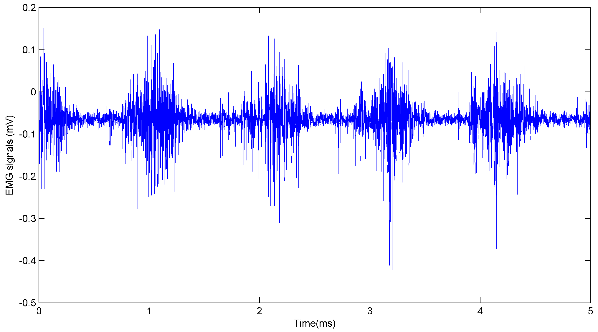
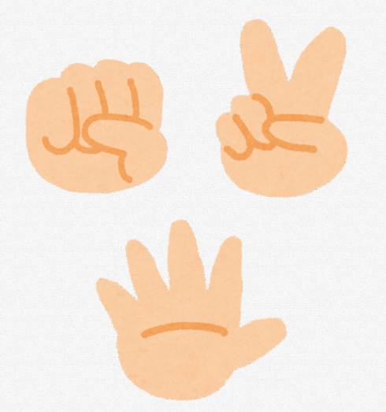
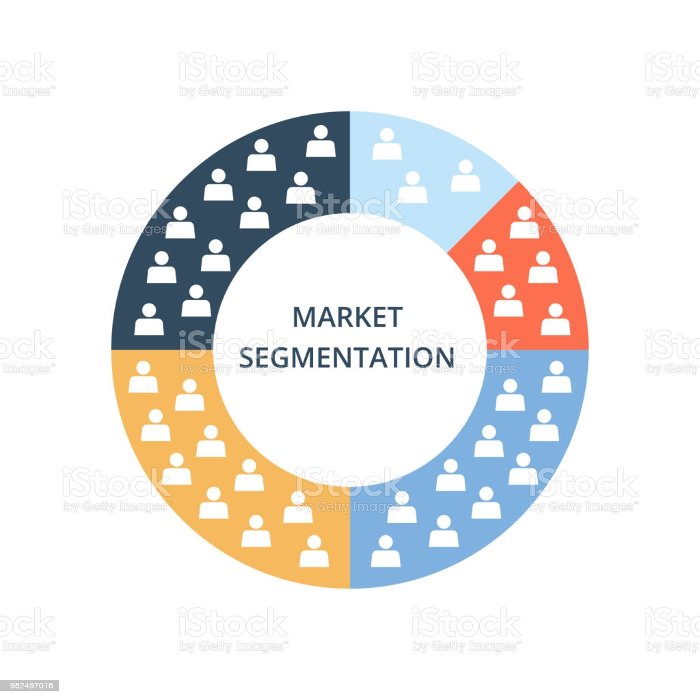

<!DOCTYPE html>
<html lang="en">
    <head>
        <meta charset="utf-8" />
        <meta name="viewport" content="width=device-width, initial-scale=1, shrink-to-fit=no" />
        <meta name="description" content="" />
        <meta name="author" content="" />
        <title>Portfolio Akmal</title>
        <!-- Favicon-->
        <link rel="icon" type="image/x-icon" href="assets/favicon.ico" />
        <!-- Font Awesome icons (free version)-->
        
        <!-- Google fonts-->
        <link href="https://fonts.googleapis.com/css?family=Montserrat:400,700" rel="stylesheet" type="text/css" />
        <link href="https://fonts.googleapis.com/css?family=Lato:400,700,400italic,700italic" rel="stylesheet" type="text/css" />
        <!-- Core theme CSS (includes Bootstrap)-->
        <link href="css/styles.css" rel="stylesheet" />
    </head>
    <body id="page-top">
        <!-- Navigation-->
        <nav class="navbar navbar-expand-lg bg-secondary text-uppercase fixed-top" id="mainNav">
            

                <a class="navbar-brand" href="#page-top">My portfolio</a>
                <button class="navbar-toggler text-uppercase font-weight-bold bg-primary text-white rounded" type="button" data-bs-toggle="collapse" data-bs-target="#navbarResponsive" aria-controls="navbarResponsive" aria-expanded="false" aria-label="Toggle navigation">
                    Menu
                    <i class="fas fa-bars"></i>
                </button>
                

                    <ul class="navbar-nav ms-auto">
                        <li class="nav-item mx-0 mx-lg-1"><a class="nav-link py-3 px-0 px-lg-3 rounded" href="#portfolio">Portfolio</a></li>
                        <li class="nav-item mx-0 mx-lg-1"><a class="nav-link py-3 px-0 px-lg-3 rounded" href="#about">About</a></li>
                        <li class="nav-item mx-0 mx-lg-1"><a class="nav-link py-3 px-0 px-lg-3 rounded" href="#contact">Contact</a></li>
                    </ul>
                

            

        </nav>
        <!-- Masthead-->
        <header class="masthead bg-primary text-white text-center">
            

                <!-- Masthead Avatar Image-->
                
                <!-- Masthead Heading-->
                <h1 class="masthead-heading text-uppercase mb-0">Ahmad Akmal Amrullah</h1>
                <!-- Icon Divider-->
                

                    

                    
<i class="fas fa-star"></i>

                    

                

                <!-- Masthead Subheading-->
                
Data Enthusiast - Data Science - Data Engineer

            

        </header>
        <!-- Portfolio Section-->
        <section class="page-section portfolio" id="portfolio">
            

                <!-- Portfolio Section Heading-->
                <h2 class="page-section-heading text-center text-uppercase text-secondary mb-0">Portofolio</h2>
                <!-- Icon Divider-->
                

                    

                    
<i class="fas fa-star"></i>

                    

                

                <!-- Portfolio Grid Items-->
                

                    <!-- Portfolio Item 1-->
                    

                        

                            

                                
<i class="fas fa-plus fa-3x"></i>

                            

                            
                        

                    

                    <!-- Portfolio Item 2-->
                    

                        

                            

                                
<i class="fas fa-plus fa-3x"></i>

                            

                            
                        

                    

                    <!-- Portfolio Item 3-->
                    

                        

                            

                                
<i class="fas fa-plus fa-3x"></i>

                            

                            
                        

                    

                    <!-- Portfolio Item 4-->
                    

                        

                            

                                
<i class="fas fa-plus fa-3x"></i>

                            

                            
                        

                    

                    <!-- Portfolio Item 5-->
                    

                        

                            

                                
<i class="fas fa-plus fa-3x"></i>

                            

                            
                        

                    

                    <!-- Portfolio Item 6-->
                    

                        

                            

                                
<i class="fas fa-plus fa-3x"></i>

                            

                            
                        

                    

                

            

        </section>
        <!-- About Section-->
        <section class="page-section bg-primary text-white mb-0" id="about">
            

                <!-- About Section Heading-->
                <h2 class="page-section-heading text-center text-uppercase text-white">About</h2>
                <!-- Icon Divider-->
                

                    

                    
<i class="fas fa-star"></i>

                    

                

                <!-- About Section Content-->
                

                    

I'm fresh graduate with Bachelor Degree of Engineering. I'm passionate with data and eager to learn more knowledge !

                    

You can download my CV and Resume here!

                

                <!-- About Section Button-->
                

                    <a class="btn btn-xl btn-outline-light" href="https://drive.google.com/file/d/1Q5AyP6H2DgtqHAvYQSf6da6p4P20Lfpy/view?usp=sharing">
                        <i class="fas fa-download me-2"></i>
                        CV + Resume
                    </a>
                

            

        </section>
        <!-- Contact Section-->
        
        <!-- Footer-->
        <footer class="footer text-center">
            

                

                    <!-- Footer Location-->
                    

                        <h4 class="text-uppercase mb-4">Location</h4>
                        

                            Jl. Yusup Marta Dilaga No.4
                             
                            Kota Serang, Serang, Banten 42112
                             
                            +62 81316984923
                        

                    

                    <!-- Footer Social Icons-->
                    

                        <h4 class="text-uppercase mb-4">Around the Web</h4>
                        <a class="btn btn-outline-light btn-social mx-1" href="#!"><i class="fab fa-fw fa-facebook-f"></i></a>
                        <a class="btn btn-outline-light btn-social mx-1" href="#!"><i class="fab fa-fw fa-twitter"></i></a>
                        <a class="btn btn-outline-light btn-social mx-1" href="https://www.linkedin.com/in/akmal-amrullah-a186211b6/"><i class="fab fa-fw fa-linkedin-in"></i></a>
<!--                        <a class="btn btn-outline-light btn-social mx-1" href="#!"><i class="fab fa-fw fa-dribbble"></i></a>-->
                    

                    <!-- Footer About Text-->
<!--
                    

                        <h4 class="text-uppercase mb-4">About Freelancer</h4>
                        

                            Freelance is a free to use, MIT licensed Bootstrap theme created by
                            <a href="http://startbootstrap.com">Start Bootstrap</a>
                            .
                        

                    

-->
                

            

        </footer>
        <!-- Copyright Section-->
        

            
<small>Copyright &copy; Your Website 2021</small>

        

        <!-- Portfolio Modals-->
        <!-- Portfolio Modal 1-->
        

            

                

                    
<button class="btn-close" type="button" data-bs-dismiss="modal" aria-label="Close"></button>

                    

                        

                            

                                

                                    <!-- Portfolio Modal - Title-->
                                    <h2 class="portfolio-modal-title text-secondary text-uppercase mb-0">Emotion Detection with LSTM</h2>
                                    <!-- Icon Divider-->
                                    

                                        

                                        
<i class="fas fa-star"></i>

                                        

                                    

                                    <!-- Portfolio Modal - Image-->
                                    
                                    <!-- Portfolio Modal - Text-->
                                    
https://github.com/r33did/SkripsiEmosiRNN

                                    <button class="btn btn-primary" href="#!" data-bs-dismiss="modal">
                                        <i class="fas fa-times fa-fw"></i>
                                        Close Window
                                    </button>
                                

                            

                        

                    

                

            

        

        <!-- Portfolio Modal 2-->
        

            

                

                    
<button class="btn-close" type="button" data-bs-dismiss="modal" aria-label="Close"></button>

                    

                        

                            

                                

                                    <!-- Portfolio Modal - Title-->
                                    <h2 class="portfolio-modal-title text-secondary text-uppercase mb-0">Rock-paper-scissor image detection</h2>
                                    <!-- Icon Divider-->
                                    

                                        

                                        
<i class="fas fa-star"></i>

                                        

                                    

                                    <!-- Portfolio Modal - Image-->
                                    
                                    <!-- Portfolio Modal - Text-->
                                    
https://github.com/r33did/Rock-paper-scissors-CNN

                                    <button class="btn btn-primary" href="#!" data-bs-dismiss="modal">
                                        <i class="fas fa-times fa-fw"></i>
                                        Close Window
                                    </button>
                                

                            

                        

                    

                

            

        

        <!-- Portfolio Modal 3-->
        

            

                

                    
<button class="btn-close" type="button" data-bs-dismiss="modal" aria-label="Close"></button>

                    

                        

                            

                                

                                    <!-- Portfolio Modal - Title-->
                                    <h2 class="portfolio-modal-title text-secondary text-uppercase mb-0">Insight from Crime and census Chicago open data</h2>
                                    <!-- Icon Divider-->
                                    

                                        

                                        
<i class="fas fa-star"></i>

                                        

                                    

                                    <!-- Portfolio Modal - Image-->
                                    
                                    <!-- Portfolio Modal - Text-->
                                    
https://github.com/r33did/Databases-and-SQL-for-Data-Science_FinalAssignment

                                    <button class="btn btn-primary" href="#!" data-bs-dismiss="modal">
                                        <i class="fas fa-times fa-fw"></i>
                                        Close Window
                                    </button>
                                

                            

                        

                    

                

            

        

        <!-- Portfolio Modal 4-->
        

            

                

                    
<button class="btn-close" type="button" data-bs-dismiss="modal" aria-label="Close"></button>

                    

                        

                            

                                

                                    <!-- Portfolio Modal - Title-->
                                    <h2 class="portfolio-modal-title text-secondary text-uppercase mb-0">Market Segmentation</h2>
                                    <!-- Icon Divider-->
                                    

                                        

                                        
<i class="fas fa-star"></i>

                                        

                                    

                                    <!-- Portfolio Modal - Image-->
                                    
                                    <!-- Portfolio Modal - Text-->
                                    
Market Segmentation with K-Means Clustering on Mall Costumer Kaggle Open Data https://www.kaggle.com/ahmadakmalamrullah/customer-segmentation-with-k-means-clustering

                                    <button class="btn btn-primary" href="#!" data-bs-dismiss="modal">
                                        <i class="fas fa-times fa-fw"></i>
                                        Close Window
                                    </button>
                                

                            

                        

                    

                

            

        

        <!-- Portfolio Modal 5-->
        

            

                

                    
<button class="btn-close" type="button" data-bs-dismiss="modal" aria-label="Close"></button>

                    

                        

                            

                                

                                    <!-- Portfolio Modal - Title-->
                                    <h2 class="portfolio-modal-title text-secondary text-uppercase mb-0">#JuaraGcp</h2>
                                    <!-- Icon Divider-->
                                    

                                        

                                        
<i class="fas fa-star"></i>

                                        

                                    

                                    <!-- Portfolio Modal - Image-->
                                    
                                    <!-- Portfolio Modal - Text-->
                                    
Finished 15 quest from GCP about SQL, Database, Data Viz, and Machine Learning  
                                      https://www.qwiklabs.com/public_profiles/0922fb0e-87e8-4286-a004-9c1bc56a5c0c
                                

                            

                        

                    

                

            

        

        <!-- Portfolio Modal 6-->
        

            

                

                    
<button class="btn-close" type="button" data-bs-dismiss="modal" aria-label="Close"></button>

                    

                        

                            

                                

                                    <!-- Portfolio Modal - Title-->
                                    <h2 class="portfolio-modal-title text-secondary text-uppercase mb-0">Titanic - Machine Learning from Disaster</h2>
                                    <!-- Icon Divider-->
                                    

                                        

                                        
<i class="fas fa-star"></i>

                                        

                                    

                                    <!-- Portfolio Modal - Image-->
                                    
                                    <!-- Portfolio Modal - Text-->
                                    
Submission for Kaggle Competition to predict survival on the Titanic disaster. Got score 78.46% https://www.kaggle.com/ahmadakmalamrullah/titanic-submission-random-forest
                                

                            

                        

                    

                

            

        

        
        <!-- Bootstrap core JS-->
        
        <!-- Core theme JS-->
        
        <!-- * * * * * * * * * * * * * * * * * * * * * * * * * * * * * * * * * * * * * * * *-->
        <!-- * *                               SB Forms JS                               * *-->
        <!-- * * Activate your form at https://startbootstrap.com/solution/contact-forms * *-->
        <!-- * * * * * * * * * * * * * * * * * * * * * * * * * * * * * * * * * * * * * * * *-->
        
    </body>
</html>
